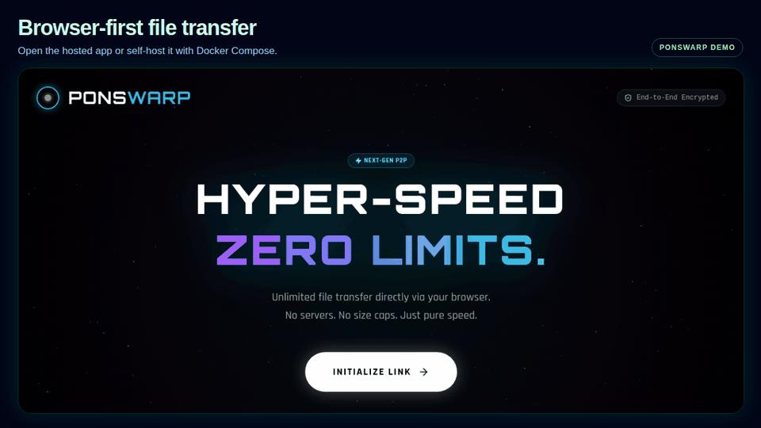
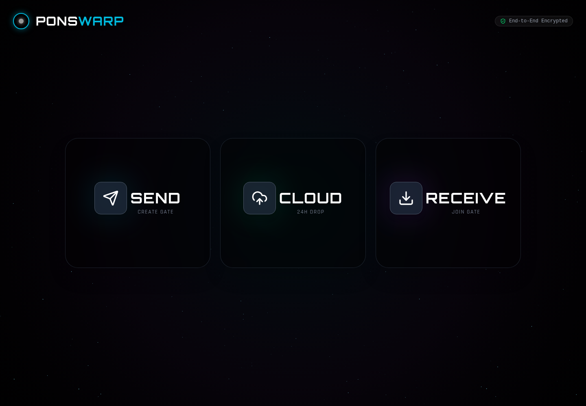
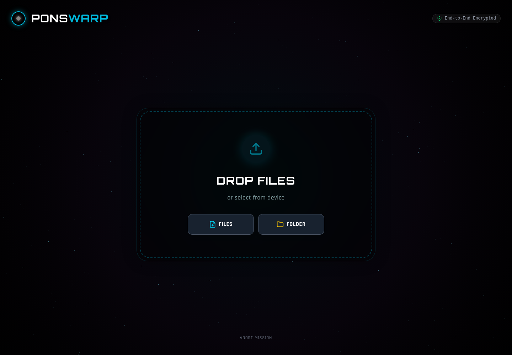
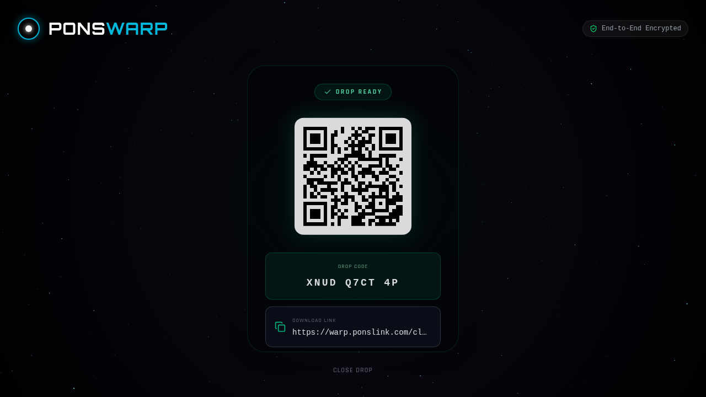
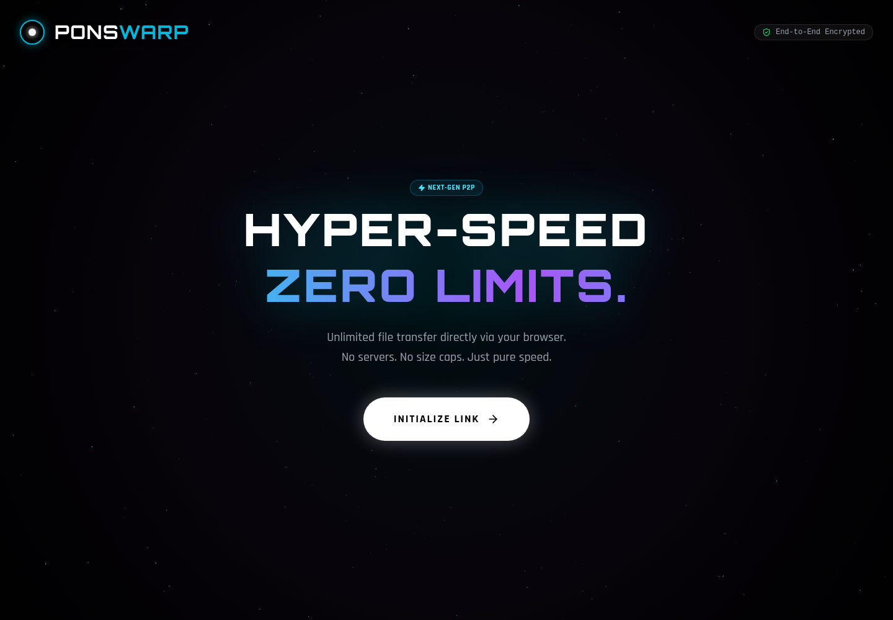
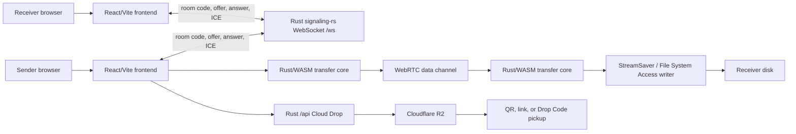

# PonsWarp

> Hosted for convenience, open for trust: large-file-safe browser P2P streaming with an integrated Rust signaling server and a bounded Cloud Drop fallback.

<p align="center">
  <a href="https://warp.ponslink.com"><strong>Live App</strong></a>
  ·
  <a href="#screenshots"><strong>Screenshots</strong></a>
  ·
  <a href="#quickstart"><strong>Quickstart</strong></a>
  ·
  <a href="#local-development"><strong>Local Development</strong></a>
  ·
  <a href="#self-hosting-and-production-deploy"><strong>Self-hosting</strong></a>
</p>

<p align="center">
  
  
  
  
  
  
</p>

<p align="center">
  
</p>

## Why PonsWarp

Browser file sharing usually hits one of two ceilings:

- link-backed services are convenient, but are bounded by storage, retention, plan, and upload limits;
- simple browser P2P tools are great for AirDrop-like flows, but are often not designed around very large streamed saves and interrupted-transfer safety.

PonsWarp keeps the large-file path direct. In **SEND / RECEIVE**, file bytes stream from the sender's browser to the receiver's browser over WebRTC data channels, with receiver-side disk writing instead of loading the whole file into memory. The hosted app is the easiest path, and the repository is self-hostable so teams can run the Rust signaling server themselves and verify the direct P2P path on their own infrastructure.

**Cloud Drop** is the offline fallback: upload once, then share a QR code, link, or Drop Code for later pickup. It is intentionally storage-backed and bounded by retention, download, and plan limits; it is not the unlimited direct-transfer path.

## Transfer Paths

| Path | Solves | Limits |
| --- | --- | --- |
| **Direct P2P SEND / RECEIVE** | Large files without server storage; bytes travel browser-to-browser over WebRTC data channels. | No app-defined size cap, but sender and receiver must stay online; NAT/firewall may require TURN; browser tab, memory, filesystem, and power-management behavior still matter. |
| **Cloud Drop** | Offline pickup by QR, link, or Drop Code when both people cannot stay online together. | Storage-backed; capped by configured Cloudflare R2 policy and plan; retention and download limits apply. Free hosted drops are 10GB for 24 hours, while paid hosted plans can allow larger/longer drops. |

## Screenshots

| Transfer Modes | Direct Send |
| --- | --- |
|  |  |

| Cloud Drop | Home |
| --- | --- |
|  |  |

## Features

- **Direct P2P transfer**: WebRTC data channels for browser-to-browser transfer.
- **Large-file streaming**: direct disk writes through StreamSaver or the File System Access API.
- **Interrupted transfer recovery**: receiver-side partial write detection plus reconnect/resume for resumable direct transfers.
- **Multi-file and folder support**: raw source-byte transfer with receiver-side ZIP64 packaging for large folder downloads.
- **Integrated Rust signaling**: in-repo `signaling-rs/` backend for WebSocket signaling, health/readiness checks, Cloud Drop APIs, and optional TURN credentials.
- **Cloud Drop**: Cloudflare R2-backed temporary links with free 24-hour drops and paid password/download-limit controls on hosted deployments.
- **Adaptive flow control**: chunk sizing, backpressure, and buffer thresholds tuned for unstable networks.
- **TURN-ready deployment**: the signaling server can provide production TURN credentials for NAT traversal.

## Architecture



### Main Pieces

| Area | Files |
| --- | --- |
| Frontend app shell and mode routing | `src/App.tsx`, `src/types/types.ts` |
| Direct sender flow | `src/components/SenderView.tsx`, `src/services/swarmManager.ts`, `src/workers/file-sender.worker.ts` |
| Direct receiver flow | `src/components/ReceiverView.tsx`, `src/services/webRTCService.ts`, `src/workers/file-receiver.worker.ts` |
| Disk writing and resume safety | `src/services/directFileWriter.ts` |
| Cloud Drop UI and client API | `src/components/CloudSenderView.tsx`, `src/components/CloudDownloadView.tsx`, `src/services/cloudShareService.ts` |
| Frontend signaling adapter | `src/services/signaling-factory.ts`, `src/services/signaling-adapter.ts`, `src/services/signaling.ts` |
| Rust signaling and Cloud Drop backend | `signaling-rs/` |
| Rust/WASM transfer core | `../pons-core-wasm/` during local workspace development; package dependency at runtime |

## Tech Stack

- **Frontend**: React 19, TypeScript 5.9, Vite 7
- **UI**: Tailwind CSS 4, Framer Motion, lucide-react
- **3D scene**: Three.js, React Three Fiber
- **P2P**: WebRTC, simple-peer
- **Signaling/API backend**: Rust, Tokio, Axum, WebSocket endpoint at `/ws`
- **Storage**: StreamSaver, File System Access API, Cloudflare R2 for Cloud Drop
- **Core**: Rust/WASM package via `pons-core-wasm`

## Quickstart

The fastest self-hosted trial uses Docker Compose. It starts the Rust signaling server and the Vite frontend from this repository, with Direct P2P enabled and Cloud Drop/billing disabled.

```bash
git clone https://github.com/DeclanJeon/PonsWarp.git
cd PonsWarp
docker compose up
```

Open `http://localhost:3500`, then test with two browsers or two browser profiles:

1. choose **SEND** in the first browser and select a small file;
2. enter the generated code in **RECEIVE** in the second browser;
3. confirm the transfer connects and the received file matches.

Compose publishes:

| Service | URL |
| --- | --- |
| Frontend | `http://localhost:3500` |
| Rust signaling/API | `http://localhost:5502` |
| Health | `http://localhost:5502/health` |
| Readiness | `http://localhost:5502/ready` |

This quickstart is intentionally direct-P2P-first. Production Cloud Drop needs object storage, retention policy, and optional billing/auth secrets; see [Environment Variables](#environment-variables) and [Self-hosting and Production Deploy](#self-hosting-and-production-deploy).

## Local Development

### Requirements

- Node.js 20+
- pnpm 8+
- Rust toolchain with Cargo
- Optional: a local or hosted TURN server for stricter NAT testing

Install frontend dependencies once:

```bash
pnpm install
```

Run the stack as two processes.

**Terminal 1: Rust signaling server**

```bash
cd signaling-rs
cp .env.local.example .env.local
cargo run
```

The local backend listens on `http://localhost:5502`, exposes WebSocket signaling at `ws://localhost:5502/ws`, and allows the Vite dev origin from `CORS_ORIGINS`.

**Terminal 2: frontend**

```bash
cp .env.local .env.local.backup 2>/dev/null || true
cat > .env.local <<'EOF'
VITE_USE_RUST_SIGNALING=true
VITE_RUST_SIGNALING_URL=ws://localhost:5502/ws
VITE_CLOUD_API_BASE_URL=http://localhost:5502
EOF
pnpm dev
```

Open the Vite URL, usually `http://localhost:3500`.

`VITE_*` values are public browser configuration. Never put API keys, OAuth secrets, TURN shared secrets, database URLs, R2 secrets, or billing secrets in frontend environment variables.

### Scripts

```bash
pnpm dev          # Start Vite
pnpm build        # Production build
pnpm preview      # Preview built app
pnpm type-check   # TypeScript validation
pnpm test         # Vitest suite
pnpm test:e2e     # Playwright smoke suite
pnpm lint         # ESLint with autofix
```

## Environment Variables

### Frontend public `VITE_*`

These are compiled into browser JavaScript and must not contain secrets.

| Variable | Required | Purpose |
| --- | --- | --- |
| `VITE_USE_RUST_SIGNALING` | Yes | Set `true` to use the Rust signaling adapter. |
| `VITE_RUST_SIGNALING_URL` | Yes | WebSocket endpoint, for example `ws://localhost:5502/ws` or `wss://example.com/ws`. |
| `VITE_CLOUD_API_BASE_URL` | Yes | Backend HTTP origin for Cloud Drop and plan APIs, for example `http://localhost:5502` or `https://example.com`. |

### Backend minimum direct-P2P env

Set these in `signaling-rs/.env.local`, `signaling-rs/.env.production`, or an external env file used by the server.

| Variable | Purpose |
| --- | --- |
| `PONSWARP_ENV` | Environment name such as `local` or `production`. |
| `HOST` / `PORT` | Bind address and port; local defaults are `127.0.0.1:5502`. |
| `LOG_LEVEL` | Rust logging level. |
| `CORS_ORIGINS` | Comma-separated allowed frontend origins. |
| `MAX_ROOM_SIZE` | Maximum peers allowed in a signaling room. |
| `ROOM_TIMEOUT` | Room lifetime/cleanup timeout. |

### Optional TURN env

TURN improves connectivity for restrictive NAT/firewall paths. Do not expose TURN shared secrets to the frontend.

| Variable | Purpose |
| --- | --- |
| `TURN_SERVER_URL` | TURN URI advertised to clients. |
| `TURN_SECRET` | Server-side shared secret for time-limited credentials. |
| `TURN_REALM` | TURN realm. |
| `TURN_ENABLE_TLS`, `TURN_ENABLE_UDP`, `TURN_ENABLE_TCP` | Advertised transport controls. |
| `TURN_PORT_UDP`, `TURN_PORT_TCP`, `TURN_PORT_TLS` | TURN ports. |
| `TURN_CREDENTIAL_TTL` | Generated credential lifetime. |
| `TURN_FALLBACK_SERVERS` | Optional STUN/TURN fallback list. |

### Optional Cloud Drop R2 env

Cloud Drop requires object storage. If enabled with incomplete R2 settings, the backend should fail startup rather than silently accepting broken uploads.

| Variable | Purpose |
| --- | --- |
| `PONSWARP_CLOUD_ENABLED` | Enables Cloud Drop APIs. |
| `R2_ACCOUNT_ID`, `R2_ACCESS_KEY_ID`, `R2_SECRET_ACCESS_KEY`, `R2_BUCKET_NAME` | Cloudflare R2 credentials and bucket. |
| `R2_ENDPOINT`, `R2_REGION` | S3-compatible endpoint and region; R2 commonly uses `auto`. |
| `PONSWARP_CLOUD_PREFIX` | Object key prefix. |
| `PONSWARP_CLOUD_RETENTION_SECONDS` | Default retention. |
| `PONSWARP_CLOUD_UPLOAD_URL_TTL_SECONDS`, `PONSWARP_CLOUD_DOWNLOAD_URL_TTL_SECONDS` | Presigned URL lifetimes. |
| `PONSWARP_CLOUD_CLEANUP_INTERVAL_SECONDS`, `PONSWARP_CLOUD_CLEANUP_RUN_ON_STARTUP` | Expired-share cleanup behavior. |
| `PONSWARP_CLOUD_MAX_FILES`, `PONSWARP_CLOUD_MAX_FILE_BYTES`, `PONSWARP_CLOUD_MAX_TOTAL_BYTES` | Cloud Drop limits. |

R2 bucket CORS must allow the frontend origin, `PUT`, `GET`, and `HEAD`, the browser upload request headers such as `content-type`, and exposed response headers including `ETag`. Multipart Cloud Drop uploads need the `ETag` header from each uploaded part.

### Optional billing, auth, and Postgres env

Required only when enabling hosted paid Cloud Drop plans, accounts, entitlement tracking, or usage history.

| Variable | Purpose |
| --- | --- |
| `PONSWARP_BILLING_ENABLED` | Enables billing and entitlement flows. |
| `PONSWARP_PUBLIC_APP_URL`, `PONSWARP_PUBLIC_API_URL` | Public frontend and backend URLs used in redirects/checkouts. |
| `PONSWARP_DEFAULT_PAYMENT_PROVIDER` | `lemonsqueezy` or `paypal`. |
| `GOOGLE_CLIENT_ID`, `GOOGLE_CLIENT_SECRET`, `GOOGLE_REDIRECT_URI` | Google OAuth login for paid flows. |
| `AUTH_SESSION_SECRET`, `AUTH_SESSION_COOKIE_NAME`, `AUTH_SESSION_TTL_SECONDS` | Server-side auth session settings. |
| `ADMIN_BOOTSTRAP_EMAILS` | Optional initial admin emails. |
| `LEMONSQUEEZY_*` | Lemon Squeezy API, store, webhook, and variant settings. |
| `PAYPAL_*` | PayPal API, plan, and webhook settings. |
| `DATABASE_URL`, `DATABASE_MAX_CONNECTIONS`, `DATABASE_RUN_MIGRATIONS` | Postgres connection and migration behavior. |

## Self-hosting and Production Deploy

A production deployment has two public surfaces on the same HTTPS origin:

- static frontend files from `dist/`;
- the Rust backend behind a reverse proxy for `/ws`, `/api/*`, `/auth/*`, `/health`, and `/ready`.

Typical flow:

```bash
# 1. Build frontend static assets
pnpm install
pnpm build

# 2. Build backend
cd signaling-rs
cargo build --release

# 3. Install/run the backend with production env
# Example: copy target/release/ponswarp-signaling-rs and run it under systemd/container
# with PONSWARP_ENV=production and secrets outside the web root.

# 4. Upload frontend dist/ to your static root or object/CDN origin
# Example paths vary by host: /var/www/ponswarp, S3/R2 Pages, Netlify, etc.
```

Reverse proxy routing requirements:

| Route | Upstream |
| --- | --- |
| `/` and static assets | Frontend `dist/` static root |
| `/ws` | Rust backend WebSocket upgrade endpoint |
| `/api/*` | Rust backend HTTP API |
| `/auth/*` | Rust backend auth/OAuth callback routes |
| `/health` | Rust backend health endpoint |
| `/ready` | Rust backend readiness endpoint |

For HTTPS deployments, set frontend env before `pnpm build`:

```env
VITE_USE_RUST_SIGNALING=true
VITE_RUST_SIGNALING_URL=wss://your-domain.example/ws
VITE_CLOUD_API_BASE_URL=https://your-domain.example
```

Backend production env should be configured in `signaling-rs/.env.production` or a secret manager/env file read by the process, not in frontend `VITE_*` values.

### Smoke Checks

After deploying, check the live backend and one real browser transfer path:

```bash
curl -fsS https://your-domain.example/health
curl -fsS https://your-domain.example/ready
curl -fsS https://your-domain.example/api/cloud-plans
```

Then open the app in two browser profiles/devices:

1. choose **SEND** in one browser and select a small test file;
2. enter the generated code in **RECEIVE** on the other browser;
3. confirm signaling connects, transfer starts, and the received file matches the original.

If Cloud Drop is enabled, also create a small drop and test pickup through its QR/link/code path.

## Comparison

| Tool | Strength | PonsWarp positioning |
| --- | --- | --- |
| PairDrop | Mature browser-based AirDrop-style sharing with simple room/device discovery. | PonsWarp focuses more narrowly on large-file-safe direct streaming, resumable receiver-side writes, and an integrated self-hostable Rust signaling/API backend. |
| LocalSend | Excellent native LAN transfer across desktop/mobile apps. | PonsWarp is browser-first: no native app install for the direct path, but it depends on browser capabilities and WebRTC connectivity. |
| Snapdrop | Lightweight browser sharing inspired by AirDrop. | PonsWarp adds a hosted/self-hostable Rust backend, large-file streaming emphasis, and optional Cloud Drop fallback rather than staying purely simple local sharing. |
| ShareDrop | Browser P2P sharing using WebRTC-style flows. | PonsWarp is positioned around very large files, direct-to-disk receive behavior, and production deployment controls including readiness checks and TURN configuration. |
| Wormhole.app | Strong encrypted expiring-link UX for sending files through a service. | PonsWarp's primary path avoids server storage for direct transfers; its Cloud Drop path is comparable only as a limited offline pickup fallback. |
| Magic Wormhole | Strong CLI/code-based secure transfer for technical users. | PonsWarp uses browser SEND/RECEIVE codes and WebRTC for non-CLI users, trading CLI ergonomics for web deployment and browser lifecycle constraints. |

## Browser Support

| Browser | Status | Notes |
| --- | --- | --- |
| Chrome / Edge | Best | File System Access API and StreamSaver behavior are strongest here. |
| Firefox | Good | Uses fallback save behavior where browser APIs differ. |
| Safari | Limited | WebRTC works, but filesystem and background transfer behavior are more restrictive. |

## Production Notes

- The public hosted app is served at `https://warp.ponslink.com`.
- Static frontend assets are built from `dist/`.
- Direct transfer depends on signaling availability and may need TURN for restrictive networks.
- Cloud Drop shares should be cleaned by the Rust backend cleanup loop and, in production, by a storage lifecycle policy aligned to each share's retention window.
- `GET /ready` should pass before the reverse proxy sends production traffic to a backend instance.
- Paid Cloud Drop checkout is a hosted feature path; self-hosters can leave billing disabled and still run direct P2P plus free/self-managed Cloud Drop limits.

## Contributing

1. Fork the repository.
2. Create a branch: `git checkout -b feature/my-change`.
3. Run focused checks for the area you changed, such as `pnpm type-check`, `pnpm test`, `pnpm build`, or `cargo build` in `signaling-rs`.
4. Open a pull request with the behavior change and verification notes.

## Acknowledgments

- [WebRTC](https://webrtc.org/) for browser-to-browser transport.
- [StreamSaver.js](https://github.com/jimmywarting/StreamSaver.js/) for large streamed saves.
- [Rust and wasm-bindgen](https://rustwasm.github.io/) for the high-performance browser core.
- [Cloudflare R2](https://developers.cloudflare.com/r2/) for temporary Cloud Drop storage.
