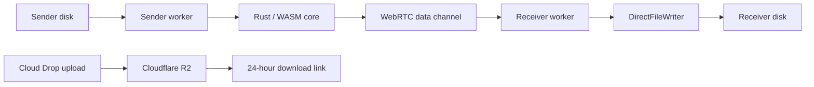

# PonsWarp

> Direct browser-to-browser file transfer for very large files, with an optional 24-hour Cloud Drop link when both people cannot stay online together.

<p align="center">
  <a href="https://warp.ponslink.com"><strong>Live App</strong></a>
  ·
  <a href="#screenshots"><strong>Screenshots</strong></a>
  ·
  <a href="#development"><strong>Development</strong></a>
</p>

<p align="center">
  
  
  
  
  
  
</p>

<p align="center">
  
</p>

## What It Does

PonsWarp has two transfer paths:

| Mode | Best For | Limit | Availability |
| --- | --- | --- | --- |
| **SEND / RECEIVE** | Maximum-size direct P2P transfer | No app-defined size cap | Sender and receiver stay online together |
| **CLOUD Drop** | Send once, share a download-only link | 10GB per share | Stored for 24 hours, then removed |

Direct mode streams bytes from the sender's disk to the receiver's disk through WebRTC. It avoids loading the full file into memory, protects against incomplete saves, and can resume interrupted single-file or multi-file transfers from the receiver's current offset after reconnect.

Cloud Drop uploads to Cloudflare R2 and returns a temporary link. It is intentionally capped at 10GB; for larger transfers, use direct P2P or split files into 10GB batches.

## Screenshots

| Transfer Modes | Direct Send |
| --- | --- |
|  |  |

| Cloud Drop | Home |
| --- | --- |
|  |  |

## Features

- **Direct P2P transfer**: WebRTC data channels for browser-to-browser transfer.
- **Large-file streaming**: direct disk writes through StreamSaver or the File System Access API.
- **Interrupted transfer recovery**: receiver-side partial write detection plus reconnect/resume for resumable direct transfers.
- **Multi-file and folder support**: raw source-byte transfer with receiver-side ZIP64 packaging for large folder downloads.
- **24-hour Cloud Drop**: Cloudflare R2-backed temporary download links for asynchronous sharing.
- **End-to-end protection**: WebRTC transport security plus the Rust/WASM transfer core.
- **Adaptive flow control**: chunk sizing, backpressure, and buffer thresholds tuned for unstable networks.
- **TURN-ready deployment**: signaling can provide production TURN credentials for NAT traversal.

## Architecture



### Main Pieces

| Area | Files |
| --- | --- |
| App shell and mode routing | `src/App.tsx`, `src/types/types.ts` |
| Direct sender flow | `src/components/SenderView.tsx`, `src/services/swarmManager.ts`, `src/workers/file-sender.worker.ts` |
| Direct receiver flow | `src/components/ReceiverView.tsx`, `src/services/webRTCService.ts`, `src/workers/file-receiver.worker.ts` |
| Disk writing and resume safety | `src/services/directFileWriter.ts` |
| Cloud Drop | `src/components/CloudSenderView.tsx`, `src/components/CloudDownloadView.tsx`, `src/services/cloudShareService.ts` |
| Signaling | `src/services/signaling-factory.ts`, `src/services/signaling-adapter.ts`, `src/services/signaling.ts` |

## Tech Stack

- **Frontend**: React 19, TypeScript 5.9, Vite 7
- **UI**: Tailwind CSS 4, Framer Motion, lucide-react
- **3D scene**: Three.js, React Three Fiber
- **P2P**: WebRTC, simple-peer
- **Signaling**: Socket.io client or Rust WebSocket signaling
- **Storage**: StreamSaver, File System Access API, Cloudflare R2
- **Core**: Rust/WASM package via `pons-core-wasm`

## Development

### Requirements

- Node.js 20+
- pnpm 8+
- A signaling server for live direct-transfer testing

### Setup

```bash
git clone https://github.com/DeclanJeon/PonsWarp.git
cd PonsWarp
pnpm install
pnpm dev
```

Create `PonsWarp/.env` when local defaults need to be overridden:

```env
VITE_USE_RUST_SIGNALING=true
VITE_RUST_SIGNALING_URL=wss://warp.ponslink.com/ws
VITE_CLOUD_API_BASE_URL=https://warp.ponslink.com
```

For local development, use `ws://localhost:5502/ws` and leave `VITE_CLOUD_API_BASE_URL` empty when the Vite dev server proxies to the same origin.

### Scripts

```bash
pnpm dev          # Start Vite
pnpm build        # Production build
pnpm preview      # Preview built app
pnpm type-check   # TypeScript validation
pnpm test         # Vitest suite
pnpm lint         # ESLint with autofix
```

## Browser Support

| Browser | Status | Notes |
| --- | --- | --- |
| Chrome / Edge | Best | File System Access API and StreamSaver behavior are strongest here. |
| Firefox | Good | Uses fallback save behavior where browser APIs differ. |
| Safari | Limited | WebRTC works, but filesystem and background transfer behavior are more restrictive. |

## Production Notes

- The public app is served at `https://warp.ponslink.com`.
- Static frontend assets are built from `dist/`.
- Direct transfer depends on signaling and TURN availability.
- Cloud Drop free shares are capped at 10GB and 24 hours. Larger offline drops can use PayPal Checkout when the backend returns `checkoutEnabled=true`.
- Cloud Drop shares should be configured with a 24-hour object lifecycle or cleanup job.
- The Rust backend should pass `GET /ready` before Nginx routes traffic to it.

## Contributing

1. Fork the repository.
2. Create a branch: `git checkout -b feature/my-change`.
3. Run `pnpm type-check`, `pnpm test`, and `pnpm build`.
4. Open a pull request with the behavior change and verification notes.

## Acknowledgments

- [WebRTC](https://webrtc.org/) for browser-to-browser transport.
- [StreamSaver.js](https://github.com/jimmywarting/StreamSaver.js/) for large streamed saves.
- [Rust and wasm-bindgen](https://rustwasm.github.io/) for the high-performance browser core.
- [Cloudflare R2](https://developers.cloudflare.com/r2/) for temporary Cloud Drop storage.
