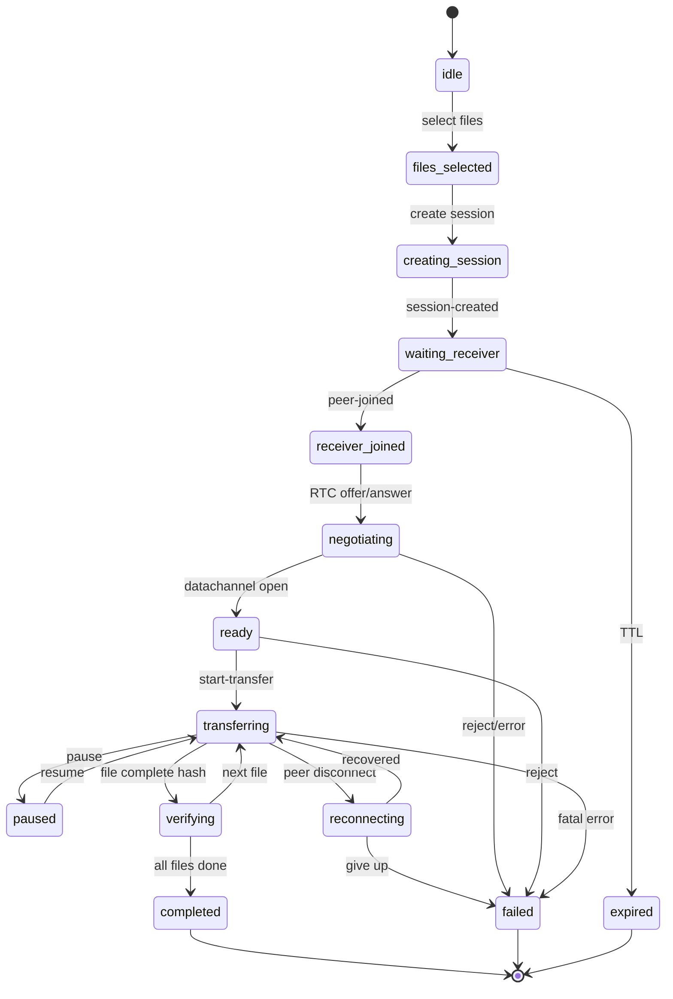

# Transfer View State Machine

## State → UI mapping

| State | Portal | Particles | Progress UI | Primary CTA |
|---|---|---|---|---|
| idle | low spin | sparse | hidden | 파일 선택 |
| files-selected | low spin | sparse | hidden | 전송 공간 만들기 |
| creating-session / waiting-receiver | waiting | medium | hidden | 코드/QR 공유 |
| receiver-joined / negotiating | unstable | rising | hidden | — |
| ready | stable high | medium | hidden | 워프 시작 / 파일 받기 |
| transferring | max | speed-mapped | shown | 일시정지 |
| paused | dim | frozen | shown | 재개 |
| reconnecting | unstable low | weak | shown (held) | 다시 연결 |
| verifying | medium | low | shown | — |
| completed | calm | sparse | 100% | 추가/종료 |
| failed / expired | static warn | stopped | held | 재시도/홈 |

## Connection mode labels

- `direct` → 보안 연결 완료 / 직접 연결됨
- `relay` → 안정적인 중계 경로로 연결되었습니다
- TURN 미설정 시 STUN only (로컬/동일 NAT에서는 직접 연결 가능)
